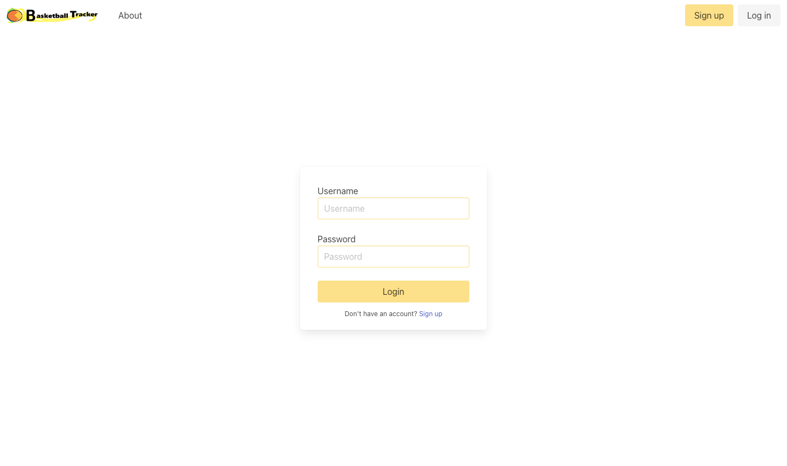

# Basketball Tracker

## Description

Basketball Tracker is an application for anyone who enjoys playing the game of basketball and would like to keep track of their individual performance. If you play weekend games with your friends or are a part of a league, (recreational or competitive), you can use this application to record some notes about how you played in a particular game. Additionally, there are some stats including points, rebounds, and assists. The application calculates totals and averages to help you evaluate your performance over time. All of this information is displayed via the dashboard, which works as your performance stat sheet. The application uses the following: 

- Node.js, Express.js, express-handlebars, handlebars, express-session, connect-session-sequelize 
- Sequelize, MySQL2, MySQL 
- the dotenv package, the bcrypt package
- Chart.js, Bulma
- model-view-controller structure
- general framework provided by edX Boot Camps LLC

## Links

Deployed Application: https://murmuring-badlands-82309.herokuapp.com/

The application includes options to sign up, log in, and log out.

Sign up by providing the following: 
- email
- username
- password

Repository: https://github.com/rak100/Performance-Tracker

## Screenshot

## License

MIT License